# Attack Experiment Roadmap
## Aligned with `main.tex` — Targeting USENIX Security / ACM CCS / IEEE S&P

> **Source of truth:** This roadmap is derived from `main.tex` Chapters 3–14 and Appendices A–D.  
> Every scenario, metric, baseline, and defense config maps 1:1 to the paper.

---

## Three Novelty Gaps (main.tex Ch. 3)

```mermaid
graph LR
    subgraph GAP1["GAP 1: Memory as Control Substrate"]
        G1["S01 · S02 · S03 · S04 · S12 · S13 · S14"]
    end
    subgraph GAP2["GAP 2: Multi-Agent Propagation"]
        G2["S06 · S10 · S15 · S04 · S05"]
    end
    subgraph GAP3["GAP 3: Complete Lifecycle Taxonomy"]
        G3["S07 · S08 · S09 + all above"]
    end

    G1 --> M1["CCR · MTR · SVR · Plan Divergence"]
    G2 --> M2["CASR · Prop Depth · Amplification · EFI"]
    G3 --> M3["Lifecycle Stage Coverage Score"]

    style GAP1 fill:#0984e3,stroke:#0984e3,color:#fff
    style GAP2 fill:#6c5ce7,stroke:#6c5ce7,color:#fff
    style GAP3 fill:#e17055,stroke:#e17055,color:#fff
```



---

## Autonomy Lifecycle (main.tex Ch. 7, Table 7.1)


---

## Four Control Primitives (main.tex Ch. 5, Table 5.1)

| Primitive | Memory Layer | Control Effect | Attack Consequence |
|-----------|:---:|---|---|
| **Skill Definition** | Procedural | Determines tool availability & arg format | Skill arbitration hijack; tool malformation |
| **Operational Constraint** | Semantic | Defines geofences, altitude limits, NFZs | Constraint injection/removal |
| **Task Assignment** | Coordination | Agent-to-task mapping & priority | Task misrouting; authority escalation |
| **Experience Policy** | Episodic | Informs planning via past outcomes | Policy manipulation; false lessons |

---

## Four Attacker Profiles (main.tex Ch. 4, Table 4.2)

| Profile | Access | Capabilities | Lifecycle Layers |
|---------|--------|-------------|-----------------|
| **A1: External Injector** | Black-box | Indirect injection via environment artifacts | Ingestion |
| **A2: Query-Only** | Black-box | Queries agents; MINJA-style progressive shortening | Ingestion, Storage |
| **A3: Compromised Scout** | Gray-box | Full Scout R/W; valid HMAC (if shared) | Ingestion, Storage, Comm |
| **A4: KB Poisoner** | White-box | Pre-inject into semantic/procedural before deploy | Storage, Retrieval |

---

## Master Scenario Catalog (main.tex Ch. 9, Tables 9.1–9.3)

| ID | Scenario | Mem Layer | Lifecycle | Attacker | Control Effect | Failure Mode | Propagation | GAP |
|----|----------|:---------:|-----------|:--------:|----------------|-------------|-------------|:---:|
| S01 | Episodic False Observation | E | Ing, Stor | A3 | Policy manipulation | Local + emergent | E→E (amplify) | 1,3 |
| S02 | Semantic Fact Corruption | S | Stor, Ret | A4 | Constraint injection | Local | None (pre-deploy) | 1 |
| S03 | Procedural Skill Hijack | P | Stor, Reas | A4 | Skill arbitration hijack | Local (DoS) | None | 1 |
| S04 | Coordination Task Misroute | C | Comm | A3 | Role/authority hijack | Emergent | C→action | 1,2 |
| S05 | Tool-Output Prompt Injection | E | Ing, Reas | A1 | Policy via false telemetry | Local | E→E | 2,3 |
| S06 | Cross-Agent Contagion | E | Comm, Ret | A3 | Swarm convergence | Emergent (swarm) | E→E→E | 2 |
| S07 | Stealth Low-Volume Insert | E | Stor, Ret | A3 | Top-k domination | Local | E→E | 3 |
| S08 | Noisy Volume Flood | E | Stor, Ret | A3 | Denial of context | Local | None | 3 |
| S09 | Recency Exploitation | E | Ret | A3 | Ranking manipulation | Local | None | 3 |
| S10 | Propagation Amplification | E,C | Comm, Ret | A3 | Multi-agent cascade | Emergent (swarm) | E→E→S (reflect) | 2 |
| S11 | Role/Authority Escalation | C | Comm | A3 | Authority escalation | Emergent | C→action | 2 |
| S12 | Constraint Injection (NFZ) | S | Ret, Reas | A3/A4 | Constraint injection | Local | S→planning | 1 |
| S13 | Skill Arbitration Hijack | P,E | Ret, Reas | A3 | Wrong tool selection | Local (DoS) | None | 1 |
| S14 | Policy Selection Hijack | E,S | Ret, Reas | A3 | Unsafe policy forced | Local | E→S (reflect) | 1 |
| S15 | Comm-State Cascade | C,E | Comm, Stor | A3 | Full swarm hijack | Emergent (critical) | C→E→E→S | 1,2,3 |

---

## Execution Mode Classification (Roadmap-specific)

```mermaid
graph TD
    subgraph RET["Mode 1: Retrieval-Only"]
        R1["Memory DB + Ollama embeddings"]
        R2["Tests: does poison enter top-k?"]
        R3["~30 sec/run · flag: --mock"]
    end
    subgraph PLAN["Mode 2: Planning-Loop"]
        P1["+ LLM chat model (gpt-oss:20b)"]
        P2["Tests: does LLM generate bad plan?"]
        P3["~2 min/run · no --mock flag"]
    end
    subgraph FULL["Mode 3: Full-Pipeline"]
        F1["+ PX4 SITL + MAVSDK + SafetyValidator"]
        F2["Tests: does drone execute dangerous action?"]
        F3["~5 min/run · flag: --full-pipeline"]
    end

    RET --> PLAN --> FULL

    style RET fill:#00b894,stroke:#00b894,color:#fff
    style PLAN fill:#fdcb6e,stroke:#fdcb6e,color:#2d3436
    style FULL fill:#d63031,stroke:#d63031,color:#fff
```



### Per-Scenario Mode Requirements

| ID | Retrieval | Planning | Full-Pipeline | Notes |
|----|:-:|:-:|:-:|---|
| S01 | ✅ | ✅ | ✅ | Coordinate redirect — the "money shot" |
| S02 | ✅ | ✅ | ✅ | Pre-deploy; test if wrong coords enter plan |
| S03 | ⚠️ | ✅ | ✅ | Tool failure only observable in pipeline |
| S04 | ✅ | ✅ | ✅ | Supervisor path (spoof_from_agent) |
| S05 | ❌ | ✅ | ✅ | Requires LLM to parse injected prompt |
| S06 | ✅ | ✅ | ✅ | Multi-step: inject → retrieve → reinforce → reflect (2 drones) |
| S07 | ✅ | ❌ | ❌ | Pure retrieval — MTR with 1–3 entries |
| S08 | ✅ | ❌ | ❌ | Pure retrieval — top-k displacement |
| S09 | ✅ | ❌ | ❌ | Timing-dependent — β contribution |
| S10 | ❌ | ❌ | ✅ | Requires multi-agent execution (2 drones) |
| S11 | ✅ | ✅ | ✅ | Supervisor only (spoof_from_agent) |
| S12 | ✅ | ✅ | ✅ | Dynamic NFZ in SafetyValidator |
| S13 | ✅ | ✅ | ✅ | Test if Scout selects wrong tool |
| S14 | ✅ | ✅ | ✅ | False emergency → conservative policy |
| S15 | ❌ | ❌ | ✅ | Multi-mission with --keep-memory (2 drones) |

---

## Metrics Catalog (main.tex Ch. 11, Table 11.1)

| Metric | Key | Formula | Range | Vulnerability Indicator |
|--------|-----|---------|:-----:|------------------------|
| ASR | `asr` | attack_goal_met / attack_runs | [0,1] | >0.5: significant |
| MCR | `mcr` | completed / total | [0,1] | Drop >20% from baseline |
| SVR | `svr` | unsafe_actions / total_actions | [0,1] | >0: safety concern |
| MTR | `mtr` | poisoned_in_topk / k | [0,1] | >0.2: compromised |
| CCR | `ccr` | poisoned_retrieved / total_retrieved | [0,1] | >0.1: contaminated |
| RIS | `ris` | 1 - contaminated/total | [0,1] | <0.8: degraded |
| CASR | `casr` | episodes_Aj_used_m* / total_episodes | [0,1] | >0: propagation |
| Prop Depth | `prop_depth` | Longest path in G | [0,n] | ≥2: chain |
| Amplification | `amplification` | affected_agents / injecting_agents | [1,n] | >1: spreading |
| EFI | `efi` | multi_only_fails / total_fails | [0,1] | >0: emergent |
| Plan Divergence | `plan_divergence` | \|tools_atk △ tools_base\| | [0,∞) | >0: altered |
| Dup Task Rate | `dup_task_rate` | duplicates / assignments | [0,1] | >0: corrupted |
| Reinforce Count | `reinforcement_count` | new entries reinforcing poison | [0,∞) | >0: amplification |
| Defense FPR | `defense_fpr` | benign_blocked / total_benign | [0,1] | High: utility loss |
| Defense FNR | `defense_fnr` | malicious_passed / total_malicious | [0,1] | High: defense fail |

---

## Results Directory Structure

```
results/
├── S01_episodic_false_obs/
│   ├── retrieval/run_001/ ... run_005/
│   ├── planning/run_001/ ... run_005/
│   └── full_pipeline/run_001/ ... run_005/
├── S02_fact_corruption/
│   ├── retrieval/
│   ├── planning/
│   └── full_pipeline/
├── S03_skill_hijack/
│   ├── planning/
│   └── full_pipeline/
├── S04_task_misroute/
│   ├── retrieval/
│   ├── planning/
│   └── full_pipeline/
├── S05_prompt_injection/
│   ├── planning/
│   └── full_pipeline/
├── S06_contagion/
│   ├── retrieval/
│   ├── planning/
│   └── full_pipeline/           ← 2 drones
├── S07_stealth_insert/
│   └── retrieval/
├── S08_volume_flood/
│   └── retrieval/
├── S09_recency_exploit/
│   └── retrieval/
├── S10_amplification/
│   └── full_pipeline/           ← 2 drones
├── S11_authority_spoof/
│   ├── retrieval/
│   ├── planning/
│   └── full_pipeline/
├── S12_virtual_nfz/
│   ├── retrieval/
│   ├── planning/
│   └── full_pipeline/
├── S13_skill_arbitration/
│   ├── retrieval/
│   ├── planning/
│   └── full_pipeline/
├── S14_policy_hijack/
│   ├── retrieval/
│   ├── planning/
│   └── full_pipeline/
├── S15_comm_cascade/
│   └── full_pipeline/           ← 2 drones, --keep-memory
├── baselines/
│   ├── B00_clean/
│   ├── B01_no_shared_memory/
│   ├── B02_no_coordination/
│   ├── B03_flat_memory/
│   ├── B04_similarity_only/
│   ├── B05_no_recency/
│   ├── B06_no_importance/
│   ├── B07_trust_only/
│   ├── B08_no_reflection/
│   ├── B09_no_provenance/
│   └── B10_per_agent_quarantine/
└── defense_sweeps/
    ├── D0_no_defense/
    ├── D1_sim_threshold/
    ├── D2_source_diversity/
    ├── D3_trust_reranking/
    ├── D4_hmac_provenance/
    └── D_all_combined/
```

Each `run_XXX/` directory contains `metrics.json` with all 15 metrics.

---

## Execution Phases

### Phase 1: GAP 1 — Memory as Control Substrate
> **Thesis:** Memory entries directly control drone behavior — they're control primitives, not passive storage.

| Step | Scenario | Mode | Seeds | What It Proves |
|:----:|----------|------|:-----:|---|
| 1.1 | S01: Episodic False Observation | R + P + F | 5 | Policy manipulation → coordinate hijack |
| 1.2 | S02: Semantic Fact Corruption | R + P + F | 5 | Constraint injection → wrong targets |
| 1.3 | S04: Coordination Task Misroute | R + P + F | 5 | Role hijack → duplicate assignments |
| 1.4 | S12: Constraint Injection (NFZ) | R + P + F | 5 | Constraint injection → target area denial |
| 1.5 | S03: Procedural Skill Hijack | P + F | 5 | Skill arbitration → tool failure |
| 1.6 | S13: Skill Arbitration Hijack | R + P + F | 5 | Wrong tool selection |
| 1.7 | S14: Policy Selection Hijack | R + P + F | 5 | False emergency → conservative policy |

**Paper delivery:** main.tex Tables 14.1 (Main Results), Section "Control-Plan Drift Evidence"

---

### Phase 2: GAP 2 — Multi-Agent Propagation
> **Thesis:** Poisoned memory spreads across agents through shared memory, amplifying impact.

| Step | Scenario | Mode | Seeds | What It Proves |
|:----:|----------|------|:-----:|---|
| 2.1 | S06: Cross-Agent Contagion | R + P + F (2 drones) | 5 | Swarm convergence; E→E→E propagation |
| 2.2 | S10: Propagation Amplification | F only (2 drones) | 5 | Single inject → A≥2; EFI>0 |
| 2.3 | S15: Comm-State Cascade | F only (keep-memory, 3 missions) | 3 | C→E→E→S; depth≥3; cross-mission persistence |
| 2.4 | S04: (already in Phase 1) | — | — | C→action path |
| 2.5 | S05: Prompt Injection | P + F | 5 | E→E; ingestion→reasoning path |
| 2.6 | S11: Authority Spoof | R + P + F | 5 | C→action; authority escalation |

**Paper delivery:** main.tex Table 14.2 (Propagation Results), Figure "Propagation Depth Distribution"

---

### Phase 3: GAP 3 — Complete Lifecycle Taxonomy
> **Thesis:** Attacks span all 5 lifecycle stages. No prior work covers all of them.

| Step | Scenario | Mode | Seeds | Lifecycle Stage |
|:----:|----------|------|:-----:|---|
| 3.1 | S07: Stealth Insert | R only | 5 | Storage, Retrieval |
| 3.2 | S08: Volume Flood | R only | 5 | Storage, Retrieval |
| 3.3 | S09: Recency Exploit | R only | 5 | Retrieval |

These complete the lifecycle coverage matrix showing attacks at every stage.

**Paper delivery:** main.tex Table 7.1 (Lifecycle Taxonomy Summary) — populate stage coverage scores

---

### Phase 4: Defense Evaluation (main.tex Ch. 12)
> Re-run key scenarios with each defense config.

| Config | Parameters | Scenarios to Test |
|--------|-----------|------------------|
| D0 | `--defense off` | S01, S06, S12 (baseline) |
| D1 | Sim threshold ∈ {0.2, 0.35, 0.5, 0.7} | S01, S06, S12 |
| D2 | Max per source ∈ {1, 2, 3} | S01, S06, S12 |
| D3 | Trust weight ∈ {0.1, 0.3, 0.5, 0.7} | S01, S06, S12 |
| D4 | HMAC provenance | S01, S06, S12 |
| D_all | All combined | S01, S06, S12 |

**Paper delivery:** main.tex Table 14.3 (Defense Efficacy), Figure "FPR/FNR Trade-off"

---

### Phase 5: Baselines & Ablations (main.tex Ch. 12, Table 12.1)

| Config | Description | What It Isolates |
|--------|------------|-----------------|
| B0 | Clean (no attack) | MCR, SVR, timing baselines |
| B1 | No shared memory | Memory-driven coordination value |
| B2 | No coordination layer | Coordination vulnerability |
| B3 | Flat memory (no layers) | Layered design benefit |
| B4 | α=1, β=0, γ=0 | Pure cosine vulnerability |
| B5 | β=0 (no recency) | Recency exploitation (S09) |
| B6 | γ=0 (no importance) | Importance gaming |
| B7 | Trust weight=1.0 | Trust defense upper bound |
| B8 | No E→S reflection | Propagation path E→S |
| B9 | No trust/provenance | Provenance defense value |
| B10 | Per-agent quarantine | Cross-contamination prevention |

---

### Phase 6: Populate Paper Tables & Cross-Comparison

| Table | Data Source |
|-------|-----------|
| Table 14.1 (Main Results) | All 15 scenarios × D0 + D_all |
| Table 14.2 (Propagation) | S06, S10, S15 |
| Table 14.3 (Defense Efficacy) | D0–D_all × S01, S06, S12 |
| Table 13.1 (Novelty Matrix) | Cross-comparison vs AgentPoison, PoisonedRAG, BadRAG, MINJA, RoboPAIR, MemDef |

---

## Experimental Protocol (main.tex Ch. 12)

| Parameter | Value |
|-----------|-------|
| **Seeds** | {42, 123, 256, 512, 1024} |
| **Reps per seed** | 1 (σ≈0 confirmed in prior runs) |
| **Total per scenario-config** | 5 runs |
| **LLM temperature** | 0.2 (default) |
| **SITL** | PX4 SITL; 2 simulated UAVs |
| **Embedding model** | `nomic-embed-text` via Ollama |
| **Chat model** | `gpt-oss:20b` via Ollama |
| **Statistical test** | Wilcoxon signed-rank (p<0.05) |

---

## Run Matrix Summary

```
Phase 1 (GAP 1): 7 scenarios × ~3 modes × 5 seeds = ~85 runs
Phase 2 (GAP 2): 6 scenarios × ~2 modes × 5 seeds = ~45 runs
Phase 3 (GAP 3): 3 scenarios × 1 mode × 5 seeds  = 15 runs
Phase 4 (Defense): 3 scenarios × 6 configs × 5 seeds = 90 runs
Phase 5 (Baselines): 11 configs × 5 seeds = 55 runs
────────────────────────────────────────────────────
Total: ~290 experiment runs
```

---

## Comparison with Prior Work (main.tex Ch. 13, Table 13.1)

| Dimension | AgentPoison | PoisonedRAG | BadRAG | MINJA | RoboPAIR | MemDef | **Ours** |
|-----------|:-:|:-:|:-:|:-:|:-:|:-:|:-:|
| Memory-as-control | ✗ | ✗ | ✗ | ✗ | ✗ | ✗ | **✓** |
| Propagation model | ✗ | ✗ | ✗ | ✗ | ✗ | ✗ | **✓** |
| Lifecycle (5 layers) | P | P | P | P | P | P | **✓** |
| Multi-agent coord attacks | ✗ | ✗ | ✗ | ✗ | ✗ | ✗ | **✓** |
| Metrics (≥14) | P | P | P | P | ✗ | P | **✓** |
| Realism (UAV/SITL) | ✗ | ✗ | ✗ | ✗ | ✓ | ✗ | **✓** |

---

## Implementation Status

| Component | File | Status |
|-----------|------|:------:|
| Attack modules S01–S15 | `attacks/s01_*.py` – `attacks/s15_*.py` | ✅ |
| Metrics (15 fields) | `uavsys/utils/metrics.py` | ✅ |
| Contagion tracker | `metrics/contagion_tracker.py` | ✅ |
| Experiment runner (3 modes) | `experiment_runner.py` | ✅ |
| Defense sweeps config | `configs/defense_sweeps.yaml` | ✅ |
| Baseline configs | `configs/baseline_configs.yaml` | ✅ |
| `spoof_from_agent` support | `uavsys/memory/memory_interface.py` | ✅ |
| Dynamic NFZ in SafetyValidator | `uavsys/utils/safety.py` | ✅ |
| Full-pipeline drone integration | `experiment_runner.py:run_full_pipeline_experiment()` | ✅ |
| MAVSDK client | `uavsys/drones/mavsdk_client.py` | ✅ |
| ScoutAgent ReAct loop | `uavsys/agents/scout.py` | ✅ |

---

## Current Progress

| Phase | Status | Notes |
|-------|:------:|-------|
| Phase 1: GAP 1 | 🔴 **READY TO RUN** | All modules built; S01 validated in prior test |
| Phase 2: GAP 2 | 🔴 **READY TO RUN** | Requires 2-drone SITL for S06, S10, S15 |
| Phase 3: GAP 3 | 🔴 **READY TO RUN** | Retrieval-only; fastest |
| Phase 4: Defense | 🔴 **READY TO RUN** | After Phase 1–3 data collected |
| Phase 5: Baselines | 🔴 **READY TO RUN** | After Phase 1–3 data collected |
| Phase 6: Paper Tables | 🔴 **WAITING** | Requires all experiment data |
